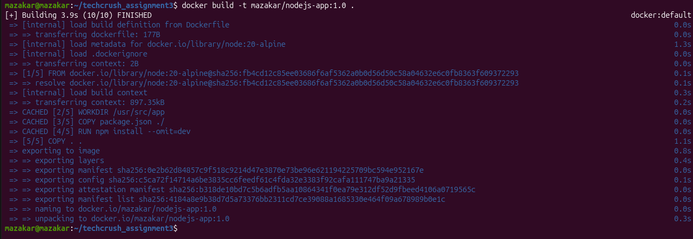
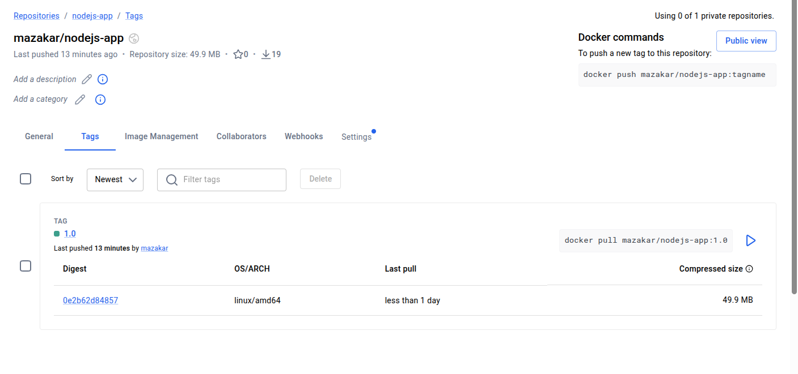
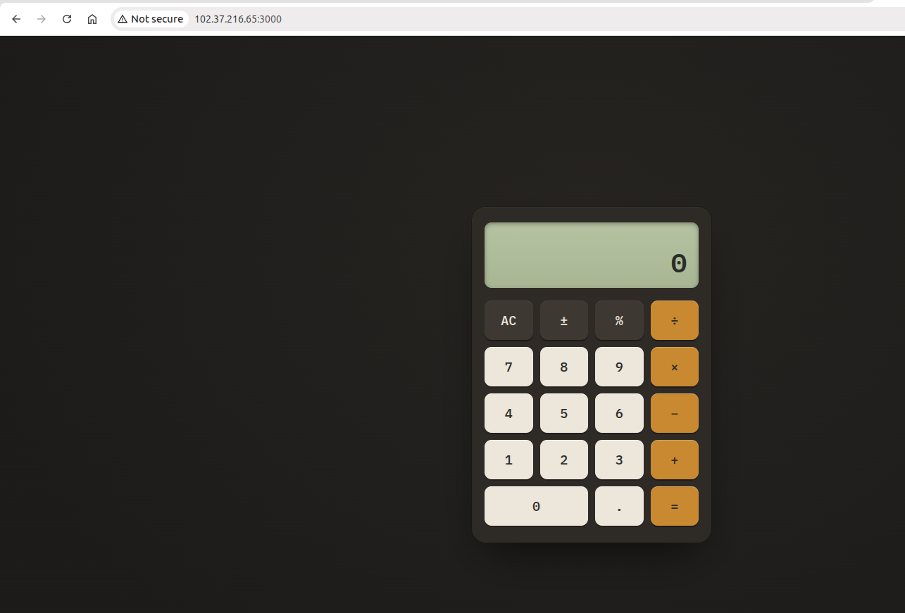

# Node.js & Docker Deployment Assignment

## 1. Docker Build Command

Screenshot of the Docker build image:

## 2. Docker Hub Image

Docker Hub repository and image tag:

## 3. Running Docker Container

Screenshot of the Docker container running:

## 4. Live Application

Screenshot of the live application running at http://102.37.216.65:3000/:

